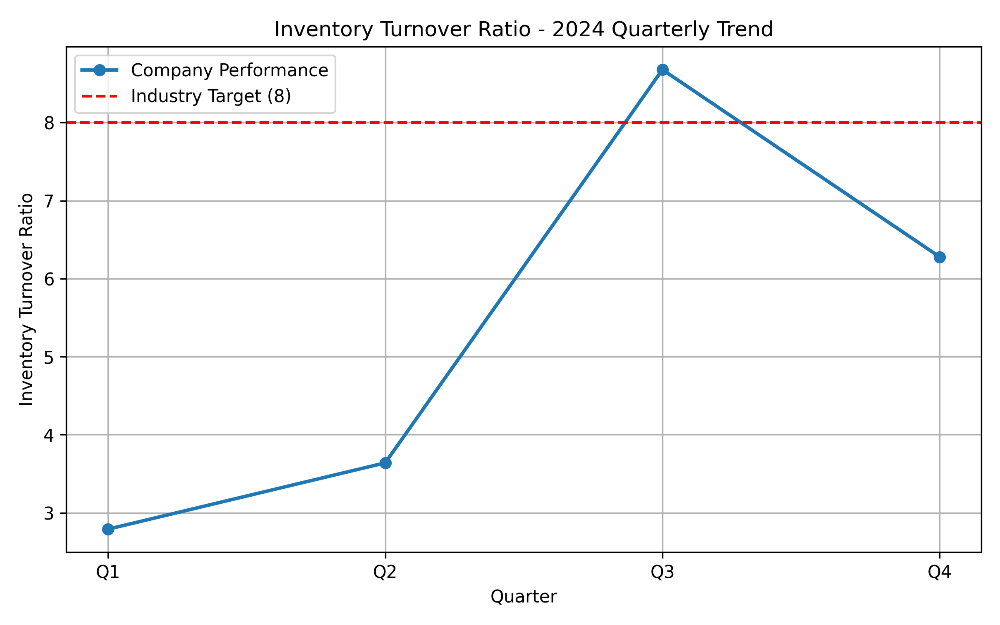

# Retail Performance Analysis - 2024 Data Story__

**📧 Analysis by:** 23f2004491@ds.study.iitm.ac.in  
**📅 Report Date:** August 20, 2025  
**🎯 Industry Benchmark Target:** 8.0  
**🤖 Generated with:** LLM/AI assistance (Jules / Codex) for comprehensive data analysis  
**🔗 LLM Reference:** https://chatgpt.com/codex/tasks  

---

## 📊 Executive Summary

The executive team has raised concerns about **inventory turnover ratio** performance, which directly impacts storage costs, cash flow, and profitability.  

Our analysis of **2024 quarterly data** reveals an **average turnover ratio of 5.35**, which is **significantly below the industry target of 8.0**. The company faces excess inventory and rising storage costs, requiring urgent optimization in supply chain and demand forecasting.  

---

## 🔢 Quarterly Performance Data

| Quarter | Inventory Turnover Ratio |
|---------|--------------------------|
| **Q1**  | 2.79 |
| **Q2**  | 3.64 |
| **Q3**  | 8.68 |
| **Q4**  | 6.28 |
| **Average** | **5.35** |

**Industry Target:** 8.0  

---

## 🔍 Key Findings

1. **Q1 (2.79) & Q2 (3.64)** showed **weak performance**, far below industry standards.  
2. **Q3 (8.68)** exceeded the benchmark, proving demand can be captured with better planning.  
3. **Q4 (6.28)** improved but still fell short of the target.  
4. **Overall Average (5.35)** remains well below the benchmark of 8.  

---

## 💼 Business Implications

- **Excess Inventory Costs:** Increased storage and carrying expenses.  
- **Cash Flow Strain:** Capital tied up in unsold goods.  
- **Missed Opportunities:** Poor performance in Q1 & Q2 delayed revenue realization.  
- **Volatility Risk:** Inconsistent turnover weakens supply chain stability.  

---

## 🎯 Recommendations

To close the gap from **5.35 → 8.0**, management should focus on **supply chain optimization and demand forecasting**:

### 1. **Optimize Supply Chain**
- Implement leaner inventory practices.  
- Improve supplier collaboration and just-in-time replenishment.  
- Use real-time tracking systems.  

### 2. **Enhance Demand Forecasting**
- Adopt AI/ML-driven forecasting models.  
- Align stock levels with seasonal demand trends.  
- Use historical sales + external factors (holidays, promotions, economic conditions).  

### 3. **Strategic Promotions**
- Introduce targeted discounts to clear slow-moving inventory.  
- Run early-quarter promotions to balance seasonal dips.  

**✅ Solution Focus:** *Optimize supply chain and demand forecasting*  

---

## 📈 Visualization

- Blue line = Company quarterly turnover ratio  
- Red dashed line = Industry target (8.0)
- 
👉 Check out the [analysis.py](analysis.py) script for the code behind this visualization.
---

## 🛠️ Supporting Files

- **`analysis.py`** → Python code to process quarterly data & generate visualization  
- **`turnover_trend.png`** → Visualization of turnover vs target  
- **`README.md`** → Business case, findings, and recommendations  

---

## 🔄 Next Steps

1. **Immediate:** Executive review of findings  
2. **Short-term (Q1 2025):** Deploy AI-driven demand forecasting model  
3. **Medium-term (Q2–Q3 2025):** Optimize supplier contracts and lean inventory practices  
4. **Long-term:** Maintain 8+ turnover ratio for sustained profitability  

---

**📧 For verification or queries, contact:** 23f2004491@ds.study.iitm.ac.in  

**🚀 Commitment:** With optimized supply chain and AI-driven demand forecasting, we project achieving the **industry benchmark of 8.0** and reducing excess inventory costs in the upcoming fiscal year. 
## 📧 Contact

For any questions, feel free to reach out:

- Name: Sonali Kumari  
- Student Email: `23f2004491@ds.study.iitm.ac.in` 
